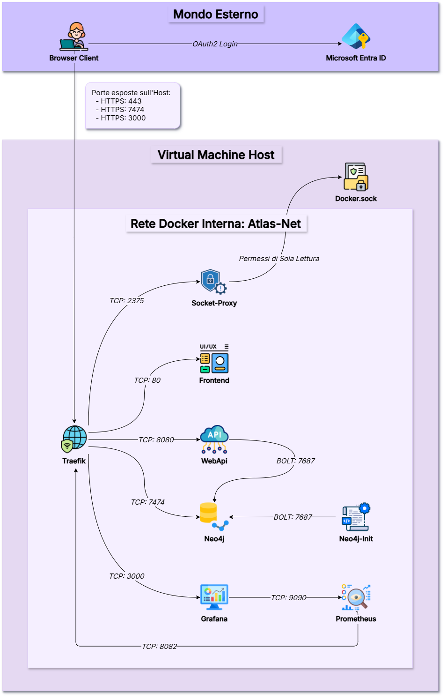
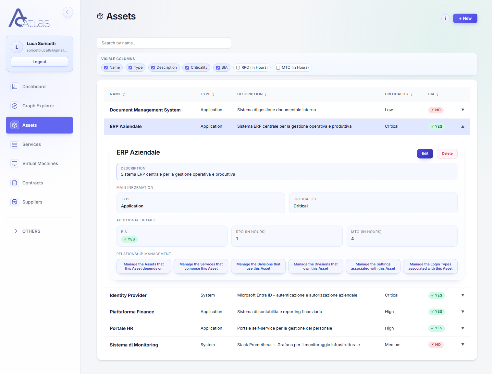
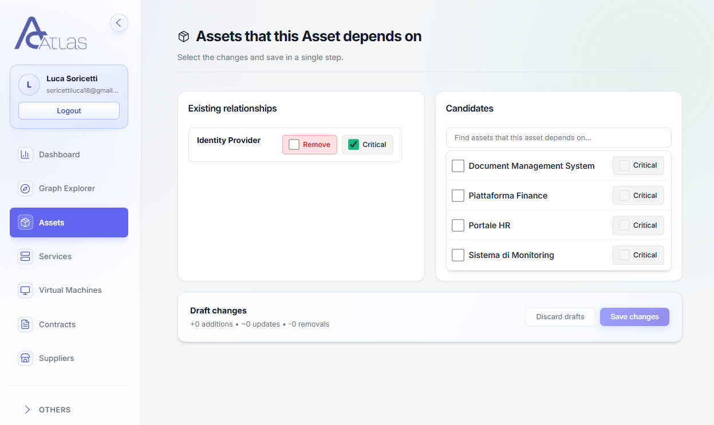
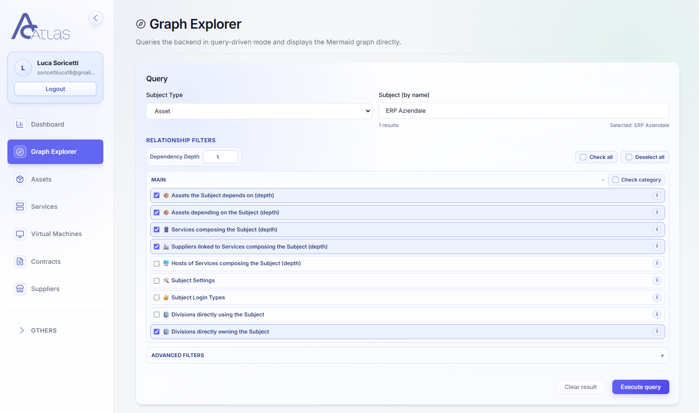
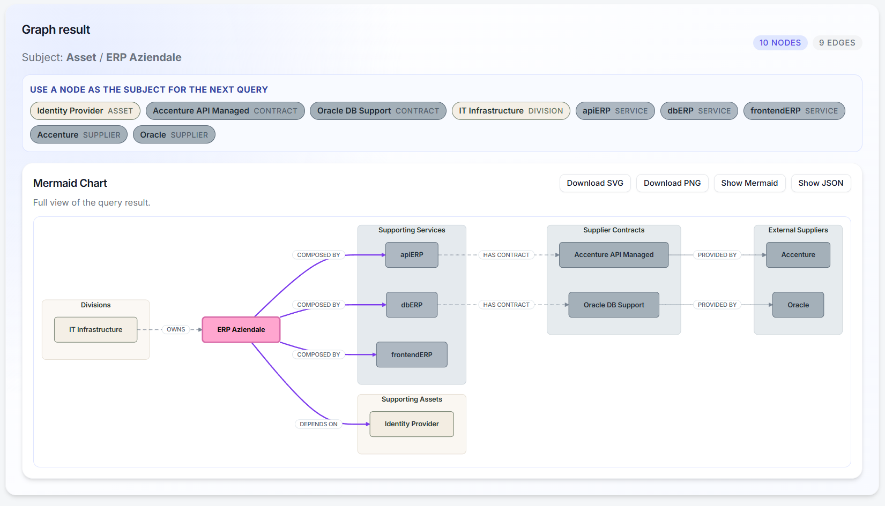

# Atlas - Docker Setup Guide [DEV + PROD]

Questo documento illustra la struttura e come setuppare gli ambienti di Development e di Production di Atlas.

# Indice

- [1) Tutorial installazione ambiente di DEV (primo avvio)](#1-tutorial-installazione-ambiente-di-dev-primo-avvio)
  - [1.1 Requisiti](#11-requisiti)
  - [1.2 Configurazione iniziale](#12-configurazione-iniziale)
  - [1.3 Avvio dello stack e certificati locali](#13-avvio-dello-stack-e-certificati-locali)
  - [1.4 Accesso ai servizi](#14-accesso-ai-servizi)
  - [1.5 Configurazione dei servizi (post-avvio)](#15-configurazione-dei-servizi-post-avvio)
    - [A. Primo accesso a Neo4j Browser](#a-primo-accesso-a-neo4j-browser)
    - [B. Monitoring con Grafana e Prometheus](#b-monitoring-con-grafana-e-prometheus)

- [2) Comandi principali e manutenzione](#2-comandi-principali-e-manutenzione)
  - [2.0 Debug build di una image che va in errore](#20-debug-build-di-una-image-che-va-in-errore)
  - [2.1 Comandi base DEV](#21-comandi-base-dev)
  - [2.2 Build e restart selettivi (utili)](#22-build-e-restart-selettivi-utili)
  - [2.3 Stop, down e volumi](#23-stop-down-e-volumi)
  - [2.4 Pulizia Docker (cache/build vecchie)](#24-pulizia-docker-cachebuild-vecchie)

- [3) Appunti tecnici, architettura e configurazioni](#3-appunti-tecnici-architettura-e-configurazioni)
  - [3.1 Architettura e sicurezza di rete](#31-architettura-e-sicurezza-di-rete)
  - [3.2 Configurazione Runtime del Frontend](#32-configurazione-runtime-del-frontend)
  - [3.3 Database Neo4j: init e persistenza](#33-database-neo4j-init-e-persistenza)
  - [3.4 Gestione delle risorse (limiti e memoria)](#34-gestione-delle-risorse-limiti-e-memoria)
  - [3.5 Gestione dei log (logging)](#35-gestione-dei-log-logging)

- [4) Diagramma architetturale](#4-diagramma-architetturale)

- [5) Verso la produzione (Production-Ready Steps)](#5-verso-la-produzione-production-ready-steps)
  - [5.1 Cosa fa il compose di produzione](#51-cosa-fa-il-compose-di-produzione)
  - [5.2 File da preparare prima dell'avvio](#52-file-da-preparare-prima-dellavvio)
  - [5.3 Avvio consigliato](#53-avvio-consigliato)
  - [5.4 Come sono gestiti i segreti](#54-come-sono-gestiti-i-segreti)
  - [5.5 Come sono gestiti i certificati TLS](#55-come-sono-gestiti-i-certificati-tls)

- [6) Note per deploy air-gapped / offline](#6-note-per-deploy-air-gapped--offline)

- [7) Manutenzione generale del disco](#7-manutenzione-generale-del-disco)
  - [7.1 Comandi di diagnostica rapida](#71-comandi-di-diagnostica-rapida)
  - [7.2 Limitare i log Docker a livello globale](#72-limitare-i-log-docker-a-livello-globale)
  - [7.3 Limitare i log di sistema journald](#73-limitare-i-log-di-sistema-journald)

> **Nota:** questa guida copre l'installazione e la configurazione generica dello stack. Le procedure operative specifiche di un particolare ambiente di produzione (hostname, path dei certificati reali, script di backup/restore, cron job, credenziali) vanno documentate separatamente in un runbook interno non pubblico, mantenuto fuori da questo repository.

## 1) Tutorial installazione ambiente di DEV (primo avvio)

### 1.1 Requisiti

- **Docker Desktop** (o Docker Engine) aggiornato.
- **Porte host libere**: `443` (Web/API), `7474` (Neo4j Browser), `3000` (Grafana).

### 1.2 Configurazione iniziale

1. Dalla root del progetto, crea il file `.env.dev` copiando o rinominando `.env.dev.example`.
2. Compila i valori del nuovo file `.env.dev`.

> **Note importanti sulle variabili:**
>
> - Docker Compose legge il file `.env` situato nella *root* della repository.
> - Le variabili `VITE_*` sono usate dal frontend e sono state predisposte per essere valutabili anche a runtime, come avviene per il backend. Questo meccanismo è descritto più avanti nella sezione [3.2](#32-configurazione-runtime-del-frontend).

### 1.3 Avvio dello stack e certificati locali

Dalla root del progetto esegui:

```bash
docker compose --env-file .env.dev -f docker-compose.yml up -d --build
```

Al primo avvio, il servizio effimero `certs-init` genera i certificati locali (`certs/localhost.pem` e `certs/localhost-key.pem`).

Se quando ti connetti a https://localhost il browser mostra l'errore `NET::ERR_CERT_AUTHORITY_INVALID`, puoi procedere in due modi:

1. **Bypass temporaneo**: accetta il rischio dal browser (ideale per sviluppo rapido).
2. **Soluzione alternativa**: importa il certificato locale nello store dei certificati fidati. Su Windows (PowerShell):

   ```powershell
   Import-Certificate -FilePath ".\certs\localhost.pem" -CertStoreLocation Cert:\CurrentUser\Root
   ```

   *(Ricorda: il trust è valido solo sulla singola macchina e va ripetuto su altri PC).*

### 1.4 Accesso ai servizi

Una volta che i container sono sani (*healthy*), i servizi sono accessibili ai seguenti endpoint:

- **App (Frontend + WebApi via Traefik)**: `https://localhost`
- **Neo4j Browser**: `https://localhost:7474` (instradato via Traefik)
- **Grafana**: `https://localhost:3000` (instradato via Traefik)
- **Health API**: `https://localhost/health`

---

### 1.5 Configurazione dei servizi (post-avvio)

#### A. Primo accesso a Neo4j Browser

1. Apri `https://localhost:7474`.
2. Nella schermata di connessione imposta:
   - **Protocol**: `https://` (oppure usa il profilo Browser standard).
   - **Connection URL**: `localhost:7474`.
   - **Database user / Password**: inserisci i valori `NEO4J_USER` e `NEO4J_PASSWORD` che hai definito nel `.env`.

> **⚠️ ATTENZIONE**
>
> Abilitare il **Neo4j Browser** consente di eseguire query dirette e **bypassa le validazioni logiche del dominio** implementate nelle API (ad esempio i controlli sui campi obbligatori).
>
> Seguire sempre le direttive di validazione del dominio applicativo ([`QueryTemplate.md`](QueryTemplate.md)) per eventuali insert manuali dei dati da console Neo4j.

> **💡 Dataset di test:**
> Per popolare rapidamente l'ambiente con dati di prova, puoi collegarti al Neo4j Browser e incollare nella console il contenuto del file [`QueryDatasetSintetico.md`](QueryDatasetSintetico.md), che genera un dataset sintetico utile per test ed esplorazione dell'app.

#### B. Monitoring con Grafana e Prometheus

Il flusso delle metriche nello stack è il seguente:

`Traefik (:8082 int.)` ➔ `Prometheus (scrape + TSDB :9090 int.)` ➔ `Grafana (query :9090, UI :3000)`

1. **Login**: vai su `https://localhost:3000` e usa `GF_SECURITY_ADMIN_USER` e `GF_SECURITY_ADMIN_PASSWORD`.
2. **Datasource Prometheus**: vai su *Connections > Data sources > Add data source*, seleziona **Prometheus**, imposta l'URL su `http://prometheus:9090` e fai *Save & test*.
3. **Import dashboard Traefik**: vai su *Dashboards > New > Import*, inserisci l'ID **`17346`** (Official Traefik Standalone) oppure **`11462`** (Community), clicca su `Load`, seleziona il datasource **Prometheus** appena creato e fai `Import`.

> **Nota bene:** se il server su cui gira Grafana non può accedere a Internet, puoi scaricare manualmente i file JSON delle dashboard e importarli da *Dashboards > New > Import*.
>
> `17346`: [https://grafana.com/api/dashboards/17346/revisions/latest/download](https://grafana.com/api/dashboards/17346/revisions/latest/download)
> `11462`: [https://grafana.com/api/dashboards/11462/revisions/latest/download](https://grafana.com/api/dashboards/11462/revisions/latest/download)
>
> Dopo aver scaricato i file JSON sul tuo PC, importali in Grafana, seleziona **Prometheus** come datasource e completa l'import.

---

## 2) Comandi principali e manutenzione

### 2.0 Debug build di una image che va in errore

- **Debug per un servizio preciso a build conclusa in errore**: `docker logs atlas-neo4j`

### 2.1 Comandi base DEV

- **Avvio completo (build inclusa)**: `docker compose --env-file .env.dev -f docker-compose.yml up -d --build`
- **Avvio senza rebuild**: `docker compose --env-file .env.dev -f docker-compose.yml up -d`
- **Stato servizi**: `docker compose --env-file .env.dev -f docker-compose.yml ps`
- **Log live di tutto lo stack**: `docker compose --env-file .env.dev -f docker-compose.yml logs -f`
- **Log live di un singolo servizio (esempio WebAPI)**: `docker compose --env-file .env.dev -f docker-compose.yml logs -f webapi`

### 2.2 Build e restart selettivi (utili)

- **Build solo frontend (senza avviare)**: `docker compose --env-file .env.dev -f docker-compose.yml build frontend`
- **Build + restart solo frontend in DEV**: `docker compose --env-file .env.dev -f docker-compose.yml up -d --build frontend`
- **Restart di un singolo servizio senza rebuild**: `docker compose --env-file .env.dev -f docker-compose.yml restart webapi`

### 2.3 Stop, down e volumi

- **Stop temporaneo (container mantenuti)**: `docker compose --env-file .env.dev -f docker-compose.yml stop`
- **Ripartenza dopo stop**: `docker compose --env-file .env.dev -f docker-compose.yml start`
- **Down senza eliminare volumi (non distruttivo sui dati)**: `docker compose --env-file .env.dev -f docker-compose.yml down`
- **⚠️ Down distruttivo con rimozione volumi (reset completo dati e database)**: `docker compose --env-file .env.dev -f docker-compose.yml down -v`

### 2.4 Pulizia Docker (cache/build vecchie)

- **Cancella cache buildx**: `docker buildx history rm --all`
- **Pulizia profonda (immagini inutilizzate, volumi anonimi, cache build)**: `docker builder prune -a --force`

---

## 3) Appunti tecnici, architettura e configurazioni

### 3.1 Architettura e sicurezza di rete

- **Socket Proxy**: per ragioni di hardening, Traefik **non** monta direttamente `/var/run/docker.sock`. Si usa `atlas-socket-proxy`, che espone in sola lettura le API di discovery/routing (POST disabilitati, `POST=0`).
- **Rete e TLS interni**: il TLS termina al bordo (Traefik); all'interno della rete Docker il traffico è in HTTP in chiaro.
- **Controllo accessi**: la porta `:443` è protetta a livello applicativo tramite Entra ID (OAuth2). Le porte `:7474` (Neo4j) e `:3000` (Grafana) non sono protette da OAuth2 e sono invece protette tramite username e password, gestite tramite `.env` in Development e tramite Docker Secrets in Production.

### 3.2 Configurazione Runtime del Frontend

Di norma, le variabili `VITE_*` prese dal `.env` vengono risolte in **compile time** e restano fisse a runtime. Per Atlas è stato implementato un meccanismo alternativo: il container Nginx genera il file `runtime-config.js` all'avvio, rendendo la configurazione modificabile anche dopo la build.

In pratica:

- **Basta riavviare il servizio** se cambi solo valori applicativi (`VITE_API_BASE_URL`, `VITE_AAD_*`, redirect URI): aggiorna `.env.prod` e fai `docker compose up -d --no-build frontend`.
- **Serve una nuova build** se cambi codice frontend, dipendenze npm, la configurazione di Nginx o lo script di bootstrap runtime.

### 3.3 Database Neo4j: init e persistenza

- **Persistenza**: Neo4j salva i dati sul volume Docker nominato `neo4j_data`. Ogni PC di ogni developer dispone quindi di un database locale distinto.
- **Inizializzazione**: i constraint definiti in `neo4j_init/init.cypher` vengono applicati dal container effimero `neo4j-init`. Le query utilizzano `IF NOT EXISTS` per garantire l'idempotenza.

> ⚠️ **Attenzione importante:** se si aggiunge una nuova entità al database (una nuova *Label*), è necessario inizializzarla anche nel file `init.cypher`.
> In caso contrario, il modello Neo4j e il codice applicativo rischiano di diventare incoerenti.

### 3.4 Gestione delle risorse (limiti e memoria)

Per impedire che un container monopolizzi l'host (OOM Kill / Throttling), sono definiti Limits e Reservations in `deploy.resources`.

| Servizio | CPU Limit | RAM Limit | RAM Reservation | Note |
| :--- | :--- | :--- | :--- | :--- |
| **neo4j** | 2.0 | 3 GB | 1.5 GB | Include heap (1G), page cache (512M) e overhead JVM. |
| **prometheus** | 1.0 | 2 GB | 512 MB | La RAM cresce nel tempo; il limite previene crash di sistema. |
| **grafana** | 1.0 | 1 GB | 256 MB | Protezione da leak di plugin o query pesanti. |
| **webapi** | 1.5 | 1 GB | 256 MB | Il GC di .NET si adatta automaticamente al limite Docker. |
| **traefik** | 0.5 | 256 MB | 128 MB | Proxy estremamente leggero. |
| **socket-proxy** | 0.5 | 128 MB | 64 MB | Traffico proxy limitato al socket Docker. |
| **frontend** | 0.5 | 128 MB | 64 MB | Web server Nginx statico; consumo minimo. |

### 3.5 Gestione dei log (logging)

In `docker-compose.yml` è applicato nativamente il driver `json-file` con rotazione dei log (es. `max-size: "10m"`, `max-file: "3"`) per evitare di saturare il disco.

**Ottimizzazioni applicate per ridurre il rumore:**

- **Grafana**: abilitato Write-Ahead Logging (`GF_DATABASE_WAL=true`) per evitare blocchi database SQLite (`SQLITE_BUSY`); log ridotti a `warn`.
- **Prometheus**: log GC e compattazioni nascosti (`--log.level=warn`).
- **WebAPI .NET**: IdentityModel logging elevato a `Warning` nel `appsettings.json` per nascondere il flooding della validazione JWT PII.
- **Neo4j**: transaction log ridotti a una conservazione massima di `100M size` anziché 7 giorni, per risparmiare spazio disco.

## 4) Diagramma architetturale e Schermate di Atlas

<details>
<summary>Visualizza lo schema dell'architettura applicativa</summary>



</details>

<details>
<summary>Visualizza la pagina web "Elenco Assets"</summary>



</details>

<details>
<summary>Visualizza la pagina web "Relazioni Assets"</summary>



</details>

<details>
<summary>Visualizza la pagina web "Filtri Interrogazione Grafo"</summary>



</details>

<details>
<summary>Visualizza la pagina web "Risultato Interrogazione Grafo"</summary>



</details>

---

## 5) Verso la produzione (Production-Ready Steps)

L'obiettivo è avere un deploy ripetibile, con segreti separati dal file di configurazione e con una gestione chiara dei certificati TLS.

### 5.1 Cosa fa il compose di produzione

Il file [`docker-compose.production.yml`](docker-compose.production.yml) usa la stessa struttura logica dello stack di sviluppo, ma con alcune differenze importanti:

1. Usa segreti esterni per le password di Neo4j e Grafana.
2. Monta i certificati TLS nel path apposito dichiarato in `.env.prod` in sola lettura.

### 5.2 File da preparare prima dell'avvio

Prima di avviare lo stack devi preparare tre cose:

1. Un file `.env.prod` derivato da [`.env.prod.example`](.env.prod.example).
2. I file dei Docker secrets:
   - [`secrets/prod/neo4j_admin_password.txt`](secrets/prod/neo4j_admin_password.example.txt) come secret reale di Neo4j.
   - [`secrets/prod/grafana_admin_password.txt`](secrets/prod/grafana_admin_password.example.txt) come secret reale di Grafana.
3. I certificati TLS già presenti sulla macchina Host nei path configurati in `.env.prod`:
   - `/your/path/to/certs/your-production-domain.com.crt`
   - `/your/path/to/certs/your-production-domain.com.key`

### 5.3 Avvio consigliato

Generalmente, l'avvio corretto in produzione è:

```bash
sudo docker compose --env-file .env.prod -f docker-compose.production.yml up -d --no-build
```

Prima di farlo, controlla che i path definiti in `.env.prod` siano davvero presenti sull'Host e che i file secret contengano password forti, non riutilizzate in altri ambienti.

### 5.4 Come sono gestiti i segreti

In produzione le password non passano più come variabili in chiaro:

1. Grafana legge l'admin password dal secret montato in `/run/secrets/grafana_admin_password` tramite `GF_SECURITY_ADMIN_PASSWORD__FILE`.
2. Neo4j legge la password dal secret montato in `/run/secrets/neo4j_admin_password` e costruisce `NEO4J_AUTH` all'avvio.
3. La Web API legge la password di Neo4j dal secret montato e la esporta al processo .NET solo dentro il container.

Questo riduce l'esposizione accidentale delle credenziali nei log, nel file `.env` e nelle inspection dei container.

### 5.5 Come sono gestiti i certificati TLS

Traefik non copia i certificati: li legge con un bind mount read-only dall'Host.

In pratica:

1. Sull'host restano i file reali, per esempio `/your/path/to/certs/your-production-domain.com.crt` e `/your/path/to/certs/your-production-domain.com.key`.
2. Nel container vengono esposti con path stabili interni, cioè `/certs/tls.crt` e `/certs/tls.key`.
3. Il file [`traefik/dynamic_conf.yml`](traefik/dynamic_conf.yml) punta a quei path interni.

Questo significa che la differenza tra DEV e PROD sta solo nei path host definiti negli env, non nella configurazione interna di Traefik.

Se l'utente con cui giri Docker Compose non ha permessi di lettura sulla chiave privata TLS (comune quando i certificati sono gestiti da un altro processo/team), puoi concedere l'accesso in lettura al solo file, senza allargare i permessi di sistema, tramite una ACL:

```bash
sudo setfacl -m u:<utente>:x /path/to/cert/dir
sudo chmod 600 /path/to/cert/dir/your-domain.key
sudo setfacl -m u:<utente>:r /path/to/cert/dir/your-domain.key
```

---

## 6) Note per deploy air-gapped / offline

Se il target di produzione non ha accesso diretto a Internet (es. VM on-prem isolata), la strategia generale è:

1. Buildare le immagini custom (`webapi`, `frontend`) su una macchina con accesso al codice sorgente.
2. Fare il pull delle immagini pubbliche usate dal compose (Traefik, Prometheus, Grafana, Neo4j, socket-proxy) sulla stessa macchina.
3. Esportare tutte le immagini (custom + pubbliche) in un unico archivio con `docker save`.
4. Trasferire l'archivio sull'host di destinazione con il metodo di trasferimento file disponibile (SCP, unità rimovibile, ecc.).
5. Caricare l'archivio nel daemon Docker di destinazione con `docker load -i <archivio>.tar`.
6. Avviare lo stack con `--no-build`, dato che le immagini sono già presenti localmente.

Per i rilasci successivi, se le immagini pubbliche non sono cambiate, è sufficiente esportare e ricaricare solo le immagini custom aggiornate, riavviando solo i servizi coinvolti:

```bash
docker compose --env-file .env.prod -f docker-compose.production.yml up -d --no-build webapi frontend
```

> Le procedure operative dettagliate (struttura cartelle di deploy, hostname, path dei certificati reali, gestione dei secret sulla macchina di produzione, script di backup/restore del database e relativa pianificazione) sono specifiche di ogni infrastruttura e vanno mantenute in un runbook interno separato, non incluso in questo repository pubblico.

---

## 7) Manutenzione generale del disco

Con il tempo, container, immagini e log possono far crescere lo spazio occupato su disco. Ecco alcune verifiche e mitigazioni generiche.

### 7.1 Comandi di diagnostica rapida

```bash
# Panoramica generale del disco
df -h
sudo du -h /var/lib --max-depth=1 2>/dev/null | sort -rh | head -10

# Stato dettagliato Docker
sudo docker system df

# Peso dei log dei singoli container
find /var/lib/docker/containers -name "*.log" -exec du -sh {} \; 2>/dev/null | sort -rh | head -10

# Peso dei log di sistema journald
journalctl --disk-usage
```

### 7.2 Limitare i log Docker a livello globale

Questa configurazione imposta un limite globale per tutti i container presenti e futuri. Aprire il file di configurazione del daemon:

```bash
sudo vim /etc/docker/daemon.json
```

Inserire o aggiornare con:

```json
{
  "log-driver": "json-file",
  "log-opts": { "max-size": "50m", "max-file": "3" }
}
```

Riavviare il daemon per applicare:

```bash
sudo systemctl restart docker
```

> **Nota bene:** questa configurazione si applica solo ai container creati **dopo** il riavvio del daemon. I container già esistenti mantengono la loro configurazione di log precedente. Per applicarla ai container Atlas già attivi, fai `docker compose down` e `up -d --no-build` dopo il riavvio del daemon.

### 7.3 Limitare i log di sistema journald

```bash
sudo vim /etc/systemd/journald.conf
```

Aggiungere o modificare:

```ini
[Journal]
SystemMaxUse=200M
```

Applicare senza riavvio:

```bash
sudo systemctl restart systemd-journald

# Pulizia immediata dei log già accumulati
sudo journalctl --vacuum-size=200M
sudo journalctl --vacuum-time=7d
```